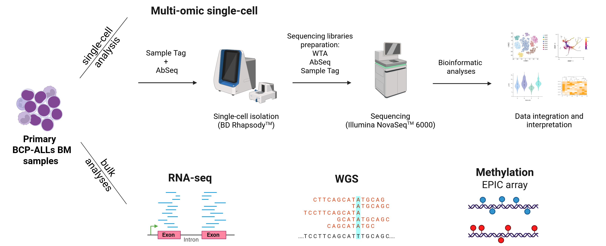

## Single-cell multiomic profiling reveals lineage plasticity in pediatric<br>B-lineage Acute Lymphoblastic Leukemia during the early phase of treatment



Code repository accompanying the manuscript:
> Gomiero G. and Peloso A. et al. *Single-cell multiomic profiling reveals lineage plasticity in pediatric B-lineage Acute Lymphoblastic Leukemia during the early phase of treatment*.

## Overview

Transient myelomonocytic switch (mmSW) is a peculiar immunophenotypic phenomenon observed during induction therapy in specific subtypes of pediatric B-cell precursor acute lymphoblastic leukemia (BCP-ALL). While its clinical behavior has been previously described, the biological mechanisms underlying this lineage switch remain poorly understood.

In this study, we applied an integrated multi-omics approach combining:

- Single-cell RNA sequencing (scRNA-seq)
- AbSeq surface protein profiling
- Whole-genome sequencing (WGS)
- Whole-transcriptome sequencing (RNAseq)
- DNA methylation profiling

to characterize diagnosis (Dx) and Day+15 (D15) bone marrow samples from pediatric BCP-ALL patients with and without transient mmSW.

Our analyses reveal that mmSW-positive BCP-ALLs harbor a pre-existing transcriptionally unstable and fate-uncertain leukemic compartment enriched for stemness and myeloid-primed programs. Longitudinal single-cell analyses demonstrate that this population undergoes transdifferentiation toward a myelomonocytic state during induction therapy. We further identify distinct mutational and epigenetic features associated with this phenomenon, supporting a model of intrinsic leukemic plasticity.

## Repository Structure

```text
scripts/
├── 01_scRNAseq_preprocessing/
│   ├── 01_data_loading/
│   ├── 02_diagnosis_samples/
│   └── 03_paired_dx_d15_samples/
│
├── 02_ALLCatchR/
├── 03_infercnv/
├── 04_pySCENIC/
├── 05_palantir/
├── 06_mellon/
├── 07_methylation/
└── 08_variants/
```

## Analysis Modules

| Module | Description |
|----------|----------|
| 01_scRNAseq_preprocessing | Data loading, quality control, normalization, integration, clustering, and cell annotation |
| 02_ALLCatchR | Gene-expression based subtype classification and signature analyses |
| 03_infercnv | Single-cell copy number variation inference |
| 04_pySCENIC | Gene regulatory network reconstruction and regulon activity analysis |
| 05_palantir | Pseudotime inference and lineage trajectory reconstruction |
| 06_mellon | Cell-state density and entropy estimation |
| 07_methylation | DNA methylation preprocessing and differential methylation analyses |
| 08_variants | Mutational landscape visualization and variant-based analyses |

## Data Availability

Raw and processed datasets generated in this study are publicly available through:

- GEO: **GSE330258**
- ArrayExpress: **E-MTAB-17083**

## Citation

```text
Gomiero G and Peloso A et al. Single-cell multiomic profiling reveals lineage plasticity in pediatric B-lineage Acute Lymphoblastic Leukemia during the early phase of treatment. [doi:]
```

## Contact

**Alberto Peloso**  
Department of Women's and Children's Health  
University of Padua
Padova, Italy

Email: [alberto.peloso@unipd.it](mailto:alberto.peloso@unipd.it)